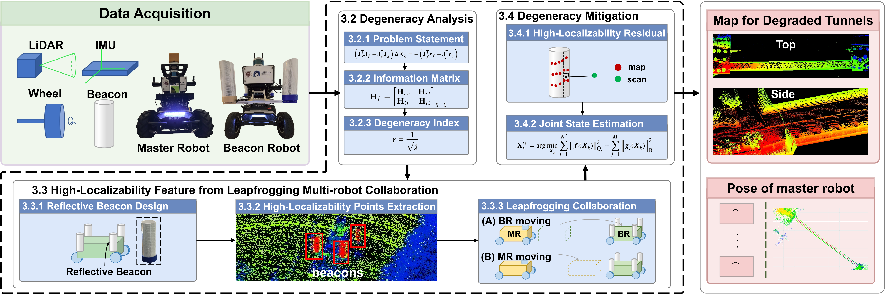
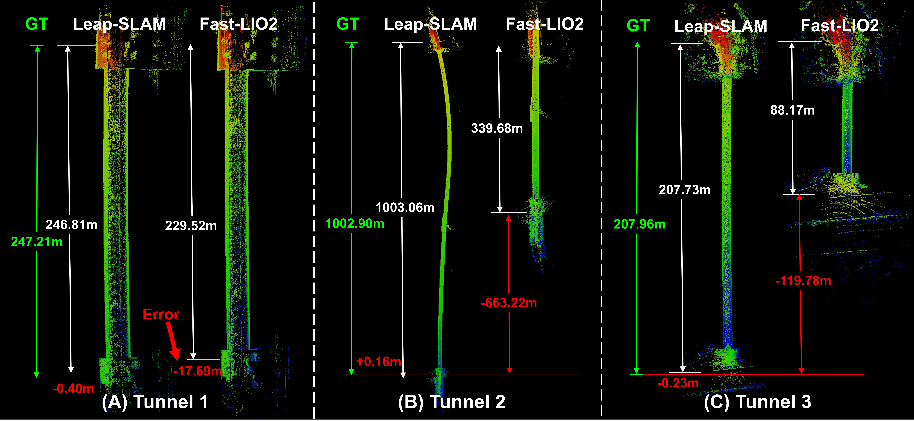
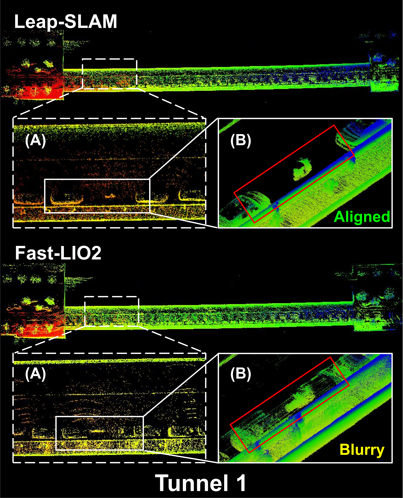

<div align="center">
  <h1>Leap-SLAM</h1>
  
  <p>
    <a href="https://doi.org/10.1016/j.inffus.2026.104538"></a>
    <a href="docs/paper.pdf"></a>
    <a href="https://js-ch3n.github.io/leap-slam.io/"></a>
    <a href="LICENSE"></a>
  </p>
</div>

## 📰 News
- **2026-06-05:** Our paper has been accepted by **Information Fusion**! 🎉  
- **2026-06-17:** The DOI is now available: [10.1016/j.inffus.2026.104538](https://doi.org/10.1016/j.inffus.2026.104538)

## 🗂️ Pipeline
<div align="center">
  
</div>

## 💾 Dataset
All the rosbag data used in this project can be downloaded from [Hugging Face](https://huggingface.co/datasets/js-ch3n/leap-slam-dataset-in-3-tunnels) ([tunnel1.bag](https://huggingface.co/datasets/js-ch3n/leap-slam-dataset-in-3-tunnels/resolve/main/tunnel1.bag), [tunnel2.bag](https://huggingface.co/datasets/js-ch3n/leap-slam-dataset-in-3-tunnels/resolve/main/tunnel2.bag), [tunnel3.bag](https://huggingface.co/datasets/js-ch3n/leap-slam-dataset-in-3-tunnels/resolve/main/tunnel3.bag)).

## ⚙️ Prerequisites
### 1. System Requirements
* **OS:** Ubuntu 20.04.
* **ROS:** Noetic. Follow the [official ROS Installation guide](http://wiki.ros.org/ROS/Installation).

### 2. Dependencies
* **PCL (>= 1.8):** Follow the [PCL Installation guide](http://www.pointclouds.org/downloads/linux.html).
* **Eigen (>= 3.3.4):** Follow the [Eigen Installation guide](http://eigen.tuxfamily.org/index.php?title=Main_Page).

### 3. Hardware Drivers
* **livox_ros_driver:** Required for Livox LiDAR integration. Follow the [official installation instructions](https://github.com/Livox-SDK/livox_ros_driver).

## 🛠️ Build & Installation
Clone the repository and build using `catkin_make`:
```bash
mkdir -p ~/leap_ws/src
cd ~/leap_ws/src
git clone https://github.com/G-SEI-Lab/Leap-SLAM.git
cd ..
catkin_make
source devel/setup.bash
```

## 🚀 Results & Demonstrations
We validated the superiority of our algorithm in three tunnel scenarios. Below are the comparison results with Fast-LIO2.

### Tunnel Mapping Length Comparison
Mapping length comparison across the three tunnels.

<div align="center">
  
</div>

### Tunnel Mapping Detail Comparison
Detailed comparison in one of the tunnels.

<div align="center">
  
</div>

## 📝 Citation

If you find this work useful, please cite our paper:

```bibtex
@article{chen2026leap,
  title={Leap-SLAM: Degeneracy-Mitigated Robust SLAM with Leapfrogging Multi-robot Collaboration in Tunnels},
  author={Chen, Shoubin and Chen, Jiasheng and Zhang, Baiyang and Yan, Maosheng and Li, Jianping and Zhang, Bo and Li, Qingquan},
  journal={Information Fusion},
  pages={104538},
  year={2026},
  publisher={Elsevier}
}
```

## Acknowledgement
This project is built upon the foundational work of [FAST-LIO2](https://github.com/hku-mars/FAST_LIO). We highly recommend referring to their repository for deeper insights into the core framework.